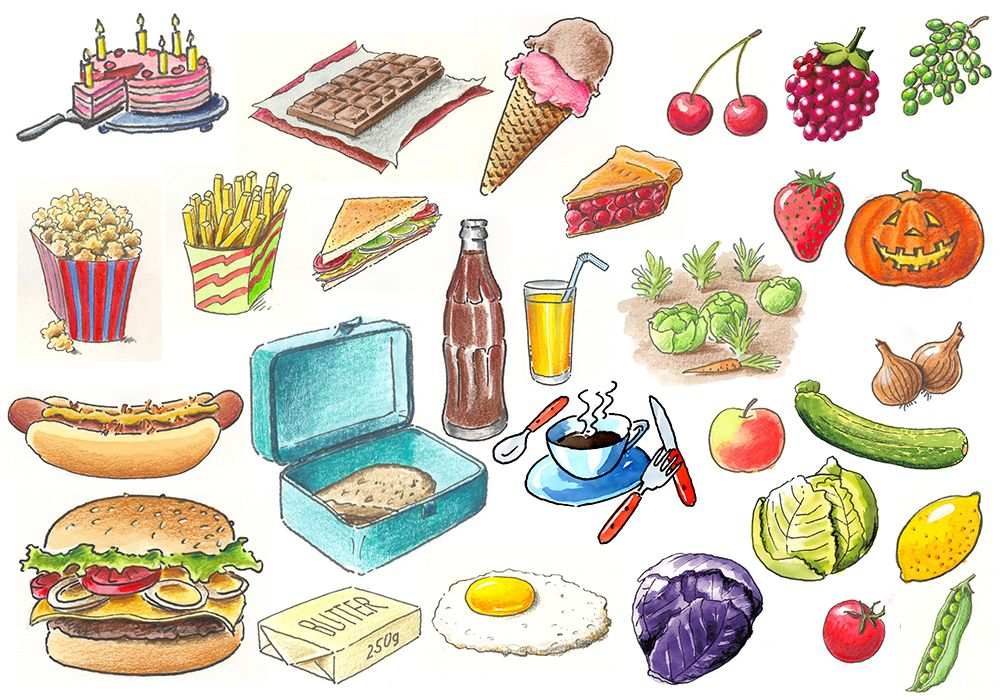

*Dieses Rezept dient als Beispielvorgabe*

# Rezept (Name des Gerichts)

Kurze Beschreibung des Gerichts.

- Zubereitungszeit: 
- Portionen:

------

### Zutaten

Auflistung der Zutaten mit Menge davor z. B.

- Zutat 1
- Zutat 2
- :

### Zubereitung

Schritt für Schritt Anleitung, um das Gericht zu kochen, z. B.

1. Schritt 1
2. Schritt 2
3. :

### Tipps und Anmerkungen

Hier können Tipps und Empfehlungen bezüglich des Rezepts beschrieben werden z. 	B.

- Tipp 1
- Tipp 2
- :

### Bilder

Hier können ein oder mehrere Bilder des fertigen Gerichts eingefügt werden z. B.

